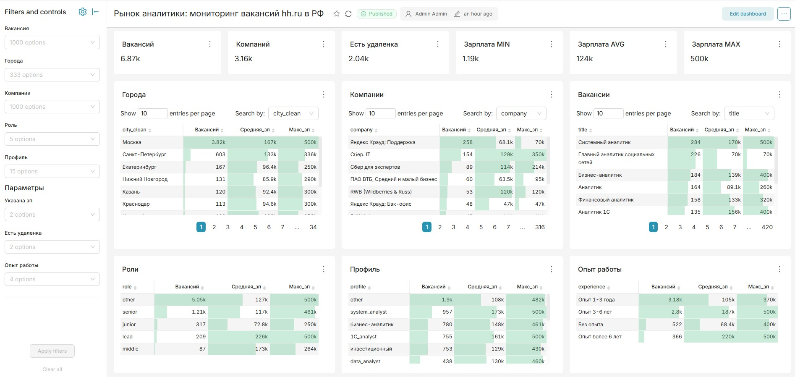

# Мониторинг рынка вакансий hh.ru

**Тип проекта:** личный инструмент и одновременно портфолио-пример полного data engineering пайплайна -
от сбора данных до дашборда.

**Ссылки:**

- [Интерактивный дашборд на сайте](https://viktor-vk.github.io/projects/hh-market/dashboard/) - актуальный срез, фильтры и список вакансий
- [Исследование рынка на 08.09.2026](https://viktor-vk.github.io/projects/hh-market/research-2026-09-08/) - выводы для соискателя
- [Страница проекта](https://viktor-vk.github.io/projects/hh-market/)
- [Рабочий репозиторий Real-time-analytics-hh](https://github.com/Viktor-VK/Real-time-analytics-hh/tree/wide-funnel) - актуальный код парсера и выгрузки для сайта

## Задача

Отслеживать рынок труда аналитиков (спрос по городам, уровням, профилям, зарплатным вилкам) не вручную
просматривая hh.ru от случая к случаю, а системно - с полным покрытием рынка и повторяемым обновлением
данных.

## Что делает пайплайн

Парсер строит **декартово произведение** из 4 измерений, чтобы получить полное покрытие рынка и
репрезентативную выборку по всем сегментам аудитории:

| Измерение | Значения |
|---|---|
| Регион | Москва / вся Россия (кроме Москвы) |
| Опыт работы | Без опыта / 1-3 года / 3-6 лет / более 6 лет |
| Формат работы | Офис / удалёнка и гибрид |
| Наличие зарплаты | Указана / не указана |

32 сегмента x до 2000 вакансий = потенциально 64k результатов; после дедупликации по `vacancy_id` остаётся
около 6500 уникальных вакансий. Поиск ограничен полем `search_field=name`, чтобы не тащить нерелевантные
результаты по совпадению текста в описании.

Запуск парсера - по необходимости обновить данные, а не по расписанию: осознанное решение, чтобы не
создавать лишнюю нагрузку на hh.ru и не попадать под антибот-блокировки.

## Архитектура

Парсинг и визуализация разнесены по двум средам: парсинг запускается вручную с обычного IP (не под
антибот-защитой дата-центра), а дашборд работает постоянно на отдельном сервере в Docker.

```
[Локальный запуск]
hh.ru
  └─► Selenium + BeautifulSoup   # парсинг страниц вакансий
        └─► pandas DataFrame      # обработка и дедупликация
              └─► CSV
                    └─► синхронизация со сервером

[Сервер, Docker]
              CSV ─► DuckDB       # импорт, дедуп по vacancy_id
                       └─► Apache Superset   # дашборд, кросс-фильтрация
```

## Дашборд



Таблицы по городам, компаниям, вакансиям, ролям, профилям и опыту работы, с кросс-фильтрацией -
можно, например, отфильтровать по роли и уровню и увидеть, как это меняет распределение по городам и
зарплатам.

## Дашборд на сайте

Superset работает на сервере для личного использования, а публичная версия - [дашборд на сайте](https://viktor-vk.github.io/projects/hh-market/dashboard/).
Он собирается из локальной копии базы скриптом `scripts/export_site_data.py` (в рабочем репозитории):
срез по последней выгрузке, те же правила разметки грейдов и специализаций, что в Superset, компактный JSON.
Страница работает в браузере без сервера: фильтры, перекрёстная фильтрация, гистограмма зарплат,
список вакансий со ссылками на hh.ru. Обновление - два шага в конце ноутбука парсера.

## Стек

| Компонент | Технология |
|---|---|
| Парсинг | Python 3.9, Selenium, BeautifulSoup |
| Обработка | pandas |
| Хранение | DuckDB |
| Визуализация | Apache Superset (Docker) |
| Дашборд на сайте | Astro + ECharts, GitHub Pages |

## Ограничения портфолио-версии

Ноутбук парсера показан целиком - это не корпоративный расчёт, а личный инструмент на публично доступных
данных hh.ru, без чужой коммерческой информации.
