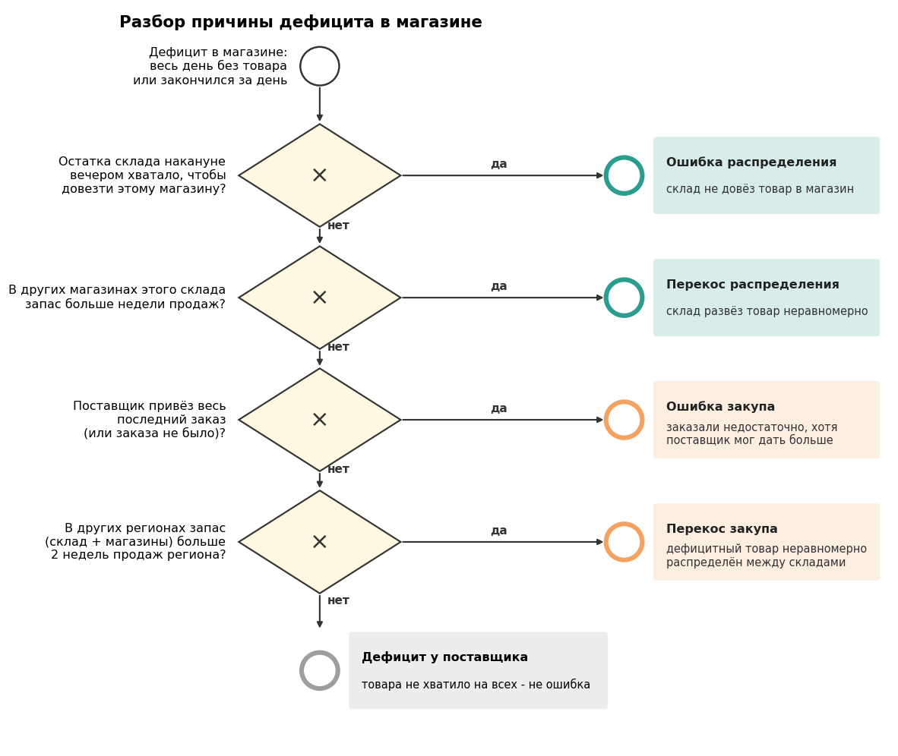

# Сквозной анализ цепи поставок

**Страница с графиками на сайте:** [viktor-vk.github.io/projects/supply-chain](https://viktor-vk.github.io/projects/supply-chain/)

**Статус:** в работе.

**Отрасль:** розничная сеть электроники.

## Задача

Когда товара нет на полке магазина, проблема могла возникнуть на любом этапе цепочки: поставщик
недопоставил, закупщик заказал мало или неравномерно, склад не довёз товар в магазин. От этапа зависит, кто
должен исправлять. Задача - восстановить движение товара по дням на всех этапах и для каждого дня дефицита
в магазине назвать причину.

## Цепочка

```
                 ПОСТАВЩИК
                     │  закуп раз в неделю (понедельник), доставка 2 дня
        ┌────────────┼────────────┐
     Склад        Склад        Склад
        │            │            │  пополнение магазинов каждый день, доставка 1 день
    магазины     магазины     магазины
```

## Как определяется причина

Остатки складов и магазинов на каждый день восстанавливаются из текущего остатка и журнала движений: из
остатка на конец периода вычитаются все движения после нужного дня. Дефицит бывает двух
видов: товара не было весь день или он закончился за день (часть покупателей пришла, когда товара уже не было).

Для каждого дня дефицита разбор идёт по цепочке вверх и останавливается на первом ответе «да»:



1. Остатка склада накануне вечером хватало, чтобы довезти товар этому магазину? - **ошибка распределения**.
   Если в дефиците несколько магазинов склада, остаток делится по очереди: сначала магазины с большими
   продажами, каждому - хотя бы на день продаж.
2. В других магазинах этого склада запас больше недели продаж? - **перекос распределения**.
3. Поставщик привёз весь последний заказ (или заказа не было)? - **ошибка закупа**: заказали недостаточно.
4. В других регионах (склад + магазины) запас больше двух недель продаж? - **перекос закупа**: дефицитный
   товар неравномерно распределён между складами.
5. Иначе - **дефицит у поставщика**: товара не хватило на всех, это не ошибка сети.

Статус модели (новинка, основная, выводимая) на разбор не влияет: если товар продаётся, его нужно закупать.

Упущенные продажи: для дня без товара - ожидаемые продажи дня (средние продажи в дни наличия, окно ±7 дней);
для дня, когда товар закончился, - ожидаемое число покупателей после того, как он кончился (спрос за день
считается пуассоновским).

## Где эффект для бизнеса

- Потери от дефицита разложены по этапам - понятно, кому ставить задачу: закупке, логистике склада или
  переговорам с поставщиком.
- Дефицит у поставщика отделён от ошибок сети: видно, какую часть потерь сеть могла предотвратить сама.
- Видно, достаточны ли фактические запасы: запас складов и магазинов в днях продаж сопоставляется с частотой
  дефицита. На синтетике узкое место - склады с запасом меньше 5 дней продаж региона, а рост запаса магазинов
  сверх 3-5 дней почти не снижает дефицит.
- Находятся изъяны самих правил, а не только разовые сбои: например, прогноз закупа по отгрузкам склада
  после дефицита занижает следующий заказ.

## Ноутбук и данные

[`01_цепь_поставок.ipynb`](01_цепь_поставок.ipynb) выполняется на синтетических данных из общей базы
[`../synthetic_data`](../synthetic_data), схема `supply`. Симуляция: 60 моделей смартфонов Apple, поставщик,
3 склада и 30 магазинов, август-октябрь 2025 с выходом iPhone 17. Разбор использует только учётные таблицы -
заказы поставщику (заказано и подтверждено), журнал движений и текущий остаток. В симуляцию специально
заложены проблемы на каждом этапе (перебои у поставщика, недозаказы и перезаказы, неравномерный закуп
дефицитного товара, пропуски пополнения и перезатарка магазинов), и в конце ноутбука проверяется, что разбор
их находит. Названия моделей реальные, цены и объёмы условные.

[`схема_разбора.py`](схема_разбора.py) рисует схему разбора `схема_разбора.png`.
